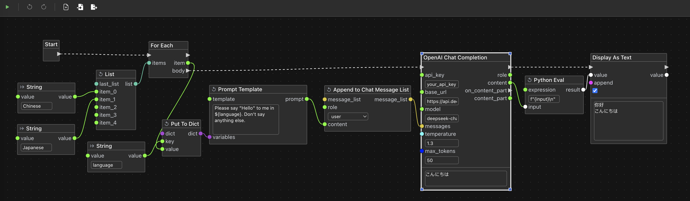

English | [中文](README_CN.md)

Floquor is a workflow building tool for large language models, designed for developers.

> **⚠️ Note:** This project is still in early development. Although currently functional, the plugin API, web interface and workflow export format may have forward-incompatible changes in the future to support new features.

---

# UI Preview


# Features
- Generality & Easy to Extend: You can extend your own nodes with very little code. Although Floquor is designed for large language model workflows, it can also be easily used in other domains by writing custom nodes.
- Flexible Orchestration: Common logic like if, for loops, for each loops, and while loops are built-in. You can also easily implement routing logic in your own nodes.
- Mix of 2 Orchestration Modes: You can manually determine the order of node execution through control flow (similar to Dify, Coze), or let the program automatically determine the execution order through data dependencies (similar to ComfyUI). Both approaches can be mixed in the same workflow.

# Installation
## Build Manually
### Prerequisites
- Install Node.JS v22 and pnpm 10.x
- Install Python 3.13
- Install git

Other versions of Node.JS and Python have not been tested, they may work normally or may have compatibility issues.

### Build and Run
```bash
# Clone frontend and backend code
git clone https://github.com/x3bits/floquor.git
git clone https://github.com/x3bits/floquor-frontend.git
# Build frontend
cd floquor-frontend
pnpm install
pnpm build
mv out ../floquor/static
# Install backend dependencies
cd ../floquor
python -m venv venv
source ./venv/bin/activate
pip install -r requirements.txt
pip install -r plugins/llm/requirements.txt
# Run backend
python main.py
```

## Using Docker
### Prerequisites
- Install Docker
- Install git
### Build Docker Image and Run
```bash
# Clone frontend and backend code
git clone https://github.com/x3bits/floquor.git
git clone https://github.com/x3bits/floquor-frontend.git
# Build image
docker build -t floquor -f floquor/Dockerfile .
# Run
docker run --rm -p 8000:8000 floquor
```

# Usage
Access [http://localhost:8000](http://localhost:8000) in your browser.
You can then drag and drop example workflows from the [examples](examples) directory into the browser window to learn how to use it.

# Developing Custom Nodes
Extending Floquor with a custom node is very simple. The [plugins](plugins) directory contains Floquor's built-in nodes. You can refer to [examples/custom-node.json](examples/custom-node.json), which is a workflow containing example custom nodes, and the corresponding example node code in [demo](plugins/demo). You can also refer to the code of other nodes in the [plugins](plugins) directory.
By the way: if you don't like the built-in nodes and want to redesign them yourself, you can even delete the built-in node directories under [plugins](plugins)! This doesn't affect the normal operation of the software.

# About the Name "Floquor"
Floquor is a compound word of "Flow" and "Loquor" (Latin: to speak). "Flow" refers to workflow, and "Loquor" refers to the action of large language models "speaking".

# Planned Features
- More nodes related to large language models
- Node support for lists and dictionaries with dynamic number of elements
- Node support for dynamic input and output names
- Support for sub-workflows, allowing workflows to be packaged as custom nodes


