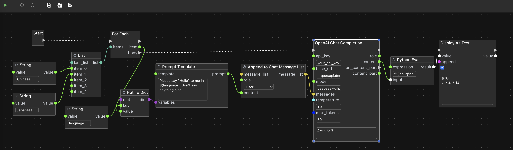

[English](README.md) | 中文

Floquor是一个面向开发者的大语言模型的工作流构建工具。

> **⚠️ 注意:** 该项目还处于早期开发阶段，虽然目前功能完整，但今后为了支持新特性，插件API、web接口及工作流导出的格式可能有向前不兼容的调整。

---

# UI预览



# 特性
 - 通用性 & 易扩展： 你可以用非常少量的代码扩展自己的节点。虽然Floquor为大语言模型工作流设计，它也很容易通过编写自定义节点用于其它领域。
 - 编排灵活： 内置了常用的逻辑，如if，for循环， for each循环，while循环。你也可以非常容易地在自己的节点主实现路由逻辑。
 - 2种编排模式的混用：你可以通过控制流手动决定节点的运行顺序（类似于Dify、Coze），也可以通过数据的依赖关系让程序自动确定运行顺序(类似于ComfyUI)。两种方式可以在同一个工作流中混用。

# 安装
## 手动构建
### 前提
 - 安装Node.JS v22和pnpm 10.x
 - 安装Python 3.13
 - 安装git

其它版本的Node.JS和Python未测试过，可能可以正常工作，也可能有兼容问题。
### 构建和运行
```bash
# clone前后端代码
git clone https://github.com/floquor/floquor.git
git clone https://github.com/floquor/floquor-frontend.git
# 打包前端
cd floquor-frontend
pnpm install
pnpm build
mv out ../floquor/static
# 安装后端依赖
cd ../floquor
python -m venv venv
source ./venv/bin/activate
pip install -r requirements.txt
pip install -r plugins/llm/requirements.txt
# 运行后端 
python main.py
```

## 使用Docker
### 前提
 - 安装Docker
 - 安装git
### 构建Docker镜像和运行
```bash
# clone前后端代码
git clone https://github.com//floquor.git
git clone https://github.com/floquor/floquor-frontend.git
# 构建镜像
docker build -t floquor -f floquor/Dockerfile .
# 运行
docker run --rm -p 8000:8000 floquor
```

# 使用
使用浏览器访问[http://localhost:8000](http://localhost:8000)
然后你可以将[examples](examples)目录下的示例工作流拖入浏览器窗口，了解使用方法。

# 开发自定义节点
为Floquor扩展一个自定义节点非常简单。[plugins](plugins)目录下有Floquor的内置节点，你可以参考[examples/custom-node.json](examples/custom-node.json)这个包含示例自定义节点的工作流以及[demo](plugins/demo)下和它对应的示例节点代码。你也可以参考[plugins](plugins)目录下的其它节点的代码。
顺便一提：如果你不喜欢自带的节点，想重新自己设计，你甚至可以将[plugins](plugins)目录下的自带节点目录删除!这并不影响软件的正常工作。

# 关于“Floquor”这个名字
Floquor是“Flow”和“Loquor”（拉丁语：说）这两个单词的合成词。“Flow”指工作流，“Loquor”指大语言模型“说话”的动作。

# 计划中的新特性
- 更多和大语言模型相关的节点
- 节点支持动态元素个数的list（列表）和dict（字典）输入
- 节点支持动态的输入名称和输出名称
- 支持子工作流，可以将工作流包装成一个自定义节点
